# STX-bfaktory Single-Sided Opportunity (SSO) Contract

A Clarity smart contract that enables community members to deposit STX and earn LP rewards by pooling with a bfaktory token provider.

## Overview

This contract creates a **single-sided liquidity opportunity** where:

- **bfaktory Provider**: Deposits bfaktory tokens to initialize the pool
- **Community Members**: Deposit STX during the entry period
- **Shared Rewards**: Both parties earn LP rewards with a 60/40 split (60% to STX depositors, 40% to bfaktory provider)

## Key Features

### 🔒 **Time-Locked Structure**

- **Entry Period**: 21 days (~3,024 blocks) for STX deposits
- **Lock Period**: ~90 days (~12,960 blocks) for LP maturation
- **Early bfaktory Withdrawal**: Unused bfaktory tokens can be withdrawn after entry period ends

### 💰 **Fair Reward Distribution**

- **STX Depositors**: Receive 60% of both STX and bfaktory rewards
- **bfaktory Provider**: Receives 40% of both STX and bfaktory rewards
- **Proportional Shares**: Rewards distributed based on individual LP token holdings

### 🛡️ **Security Features**

- Single initialization prevents double-setup
- Entry period restrictions prevent late deposits
- Authorization checks for depositor-only functions
- Automatic cleanup of user positions after withdrawal

## Contract Flow

```mermaid
graph TD
    A[bfaktory Provider Initializes Pool] --> B[21-Day Entry Period]
    B --> C[Community Deposits STX]
    C --> D[STX + bfaktory → LP Tokens]
    D --> E[Entry Period Ends]
    E --> F[Provider Can Withdraw Unused bfaktory]
    E --> G[90-Day Lock Period]
    G --> H[Withdraw LP Tokens + Rewards]
    H --> I[60/40 Split Distribution]
```



## Functions

### **Initialization**

```clarity
(initialize-bfaktory-pool (bfaktory-amount uint))
```

- **Who**: bfaktory provider only
- **When**: Once, at contract start
- **What**: Deposits bfaktory tokens and starts the entry period

### **Community Participation**

```clarity
(deposit-stx-for-lp (stx-amount uint))
```

- **Who**: Community members (not the bfaktory provider)
- **When**: During 21-day entry period only
- **What**: Deposits STX, pairs with bfaktory, receives LP tokens

### **Withdrawals**

```clarity
(withdraw-lp-tokens)
```

- **Who**: STX depositors
- **When**: After 90-day lock period
- **What**: Withdraws LP position with 60/40 reward split

```clarity
(withdraw-lp-tokens-depositor (user principal))
```

- **Who**: bfaktory provider only
- **When**: After 90-day lock period
- **What**: Withdraws on behalf of any user (helpful for inactive users)

```clarity
(withdraw-remaining-bfaktory)
```

- **Who**: bfaktory provider only
- **When**: After 21-day entry period
- **What**: Withdraws any unused bfaktory tokens

### **Read-Only Functions**

```clarity
(get-pool-info)
(get-user-lp-tokens (user principal))
(get-quote-for-lp (stx-amount uint))
(calculate-amounts-for-lp (stx-amount uint))
```

## Example Usage

### 1. Provider Setup

```clarity
;; Provider deposits 1000 bfaktory tokens
(contract-call? .sso-contract initialize-bfaktory-pool u1000000000000000)
```

### 2. Community Participation

```clarity
;; User deposits 100 STX during entry period
(contract-call? .sso-contract deposit-stx-for-lp u100000000)
```

### 3. Post-Lock Withdrawal

```clarity
;; User withdraws after lock period (gets 60% of rewards)
(contract-call? .sso-contract withdraw-lp-tokens)
```

## Economic Model

### **Capital Efficiency**

- Community provides STX liquidity
- Provider provides bfaktory liquidity
- Combined liquidity earns Alex AMM LP rewards

### **Risk/Reward Distribution**

- **STX Risk**: Price volatility, IL risk
- **bfaktory Risk**: Price volatility, IL risk
- **Reward**: 60% to STX providers, 40% to bfaktory provider
- **IL Protection**: None (standard AMM IL applies)

### **Provider Incentives**

- 40% reward share for providing bfaktory liquidity
- Early access to unused capital (after entry period)
- Ability to assist with user withdrawals

## Technical Details

### **AMM Integration**

- Uses Alex AMM v2 pools
- Factor: `u100000000` (standard)
- Tokens: wSTX-v2 / wbfaktory pair

### **Precision & Dust**

- Uses 8-decimal fixed-point arithmetic
- Expected dust: ~0.01-0.02% per withdrawal
- Dust is negligible and self-balancing across users

### **Block Time Assumptions**

- ~144 blocks per day (Stacks average)
- Entry period: 3,024 blocks ≈ 21 days
- Lock period: 12,960 blocks ≈ 90 days

## Error Codes

| Code | Error                     | Description                           |
| ---- | ------------------------- | ------------------------------------- |
| 403  | `ERR_UNAUTHORIZED`        | Caller not authorized for this action |
| 404  | `ERR_NOT_INITIALIZED`     | Pool not initialized yet              |
| 405  | `ERR_ALREADY_INITIALIZED` | Pool already initialized              |
| 406  | `ERR_INSUFFICIENT_AMOUNT` | Amount must be greater than 0         |
| 407  | `ERR_STILL_LOCKED`        | Lock period not yet finished          |
| 408  | `ERR_NO_DEPOSIT`          | No LP tokens to withdraw              |
| 409  | `ERR_TOO_LATE_BRO`        | Entry period has ended                |

## Security Considerations

### ✅ **Protections**

- Single initialization prevents re-setup attacks
- Time-based restrictions prevent gaming entry/exit
- Authorization checks prevent unauthorized actions
- Proportional reward distribution prevents gaming

### ⚠️ **Risks**

- **Impermanent Loss**: Standard AMM IL applies to all participants
- **Smart Contract Risk**: Depends on Alex AMM security
- **Price Risk**: Both STX and bfaktory token price volatility
- **Liquidity Risk**: Tokens locked for 90+ days

### 🔍 **Audit Notes**

- No external calls except to verified Alex contracts
- No admin functions beyond provider privileges
- Time-locked design prevents rug pulls
- Dust amounts (~0.01%) are within acceptable DeFi ranges

## Integration

### **Prerequisites**

- Alex AMM v2 deployed and functional
- wSTX-v2 and wbfaktory tokens available
- Existing wSTX/wbfaktory pool with sufficient liquidity

### **Dependencies**

- `SP102V8P0F7JX67ARQ77WEA3D3CFB5XW39REDT0AM.amm-pool-v2-01`
- `SP102V8P0F7JX67ARQ77WEA3D3CFB5XW39REDT0AM.token-wstx-v2`
- `SP1KK89R86W73SJE6RQNQPRDM471008S9JY4FQA62.token-wbfaktory`

## License

This contract is provided as-is for educational and operational purposes. Users should conduct their own security audits before mainnet deployment.
